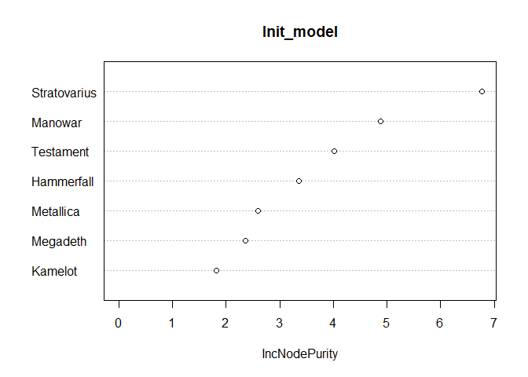
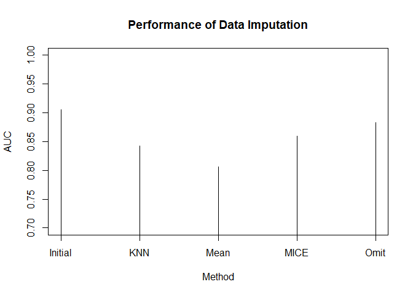

Multivariate Post 1
================
Brian Childers
December 10, 2018

This post tests several methods for handling missing data on a dataset of music listening history from Last.FM. I use data that capture show times each user has listened to some of my favorite metal bands to predict if they listen to my favorite band, Blind Guardian. I assess my model's performance, then randomly delete some of the data to see how well different methods recover the predictive power of the original model.

First, I read in the data and format it properly.

``` r
setwd("C://Users/Brian/Desktop")

library(readr)
library(sqldf)
library(randomForest)
library(ROCR)


#download.file("http://mtg.upf.edu/static/datasets/last.fm/lastfm-dataset-1K.tar.gz",destfile="tmp.tar.gz")
#untar("tmp.tar.gz")

mus <- read_tsv('lastfm-dataset-1k/userid-timestamp-artid-artname-traid-traname.tsv',
                col_names = c("User", "timestamp", "artistID", "artname", "trackid","trackname"))
Music <- na.omit(mus[,c(1,4)])

Music_Agg <- sqldf('SELECT User, count(artname) AS Listens
             FROM Music
             GROUP BY User')
```

Next, I extract information for the bands I am interested in. I create a dependent variable that represents if a given user has listened to Blind Guardian more than twice, indicating to me that they "listen" to them more than just coincidentally. A readout of what the data looks like is below.

``` r
Blind_Guardian <- Music[which(Music$artname == 'Blind Guardian'),]
Blind_Guardian_agg <- aggregate(artname ~ User, data=Blind_Guardian , FUN=length); colnames(Blind_Guardian_agg) <- c('User','Blind_Guardian')

Stratovarius <- Music[which(Music$artname == 'Stratovarius'),]
Stratovarius_agg <- aggregate(artname ~ User, data=Stratovarius , FUN=length); colnames(Stratovarius_agg) <- c('User','Stratovarius')

Megadeth <- Music[which(Music$artname == 'Megadeth'),]
Megadeth_agg <- aggregate(artname ~ User, data=Megadeth , FUN=length); colnames(Megadeth_agg) <- c('User','Megadeth')

Testament <- Music[which(Music$artname == 'Testament'),]
Testament_agg <- aggregate(artname ~ User, data=Testament , FUN=length); colnames(Testament_agg) <- c('User','Testament')

Kamelot <- Music[which(Music$artname == 'Kamelot'),]
Kamelot_agg <- aggregate(artname ~ User, data=Kamelot , FUN=length); colnames(Kamelot_agg) <- c('User','Kamelot')

Metallica <- Music[which(Music$artname == 'Metallica'),]
Metallica_agg <- aggregate(artname ~ User, data=Metallica , FUN=length); colnames(Metallica_agg) <- c('User','Metallica')

Hammerfall <- Music[which(Music$artname == 'Hammerfall'),]
Hammerfall_agg <- aggregate(artname ~ User, data=Hammerfall , FUN=length); colnames(Hammerfall_agg) <- c('User','Hammerfall')

Manowar <- Music[which(Music$artname == 'Manowar'),]
Manowar_agg <- aggregate(artname ~ User, data=Manowar , FUN=length); colnames(Manowar_agg) <- c('User','Manowar')

Agg <- Reduce(function(x, y) merge(x, y, all=TRUE), list(Blind_Guardian_agg, Stratovarius_agg, Metallica_agg,Hammerfall_agg,
                                                         Megadeth_agg, Testament_agg, Kamelot_agg, Manowar_agg))
Data <- merge(Agg, Music_Agg, by="User", all=T)
Data[is.na(Data)] <- 0
Data$Listens_BG <- ifelse(Data$Blind_Guardian>2,1,0)
head(Data)
```

    ##          User Blind_Guardian Stratovarius Metallica Hammerfall Megadeth
    ## 1 user_000001              0            0         0          0        0
    ## 2 user_000002              0            0         0          0        0
    ## 3 user_000003              0            0         0          0        1
    ## 4 user_000004              4            3         2          0        0
    ## 5 user_000005              0            0         0          0        0
    ## 6 user_000006              0            0        23          0        0
    ##   Testament Kamelot Manowar Listens Listens_BG
    ## 1         0       0       0   16685          0
    ## 2         0       0       0   57438          0
    ## 3         0       0       0   19494          0
    ## 4         0       1       0   18411          1
    ## 5         0       0       0   20341          0
    ## 6         0       0       0   27782          0

As you can tell, this data is not only for metal fans, so many users do not listen to any of these bands, or maybe have just a few listens. This is important for the data missingness issue. There is not one single way which is always best to deal with missing data, but the optimal method depends on how your data looks and what you want to do with it. In this case, with a lot of data at 0 and some at very high values (representing people who listen to a band thousands of times), replacing data by mean may not be an optimal method, for example.

I split the data into 50% train and 50% test.

``` r
smp_size <- floor(0.5 * nrow(Data))
set.seed(36)
train_ind <- sample(seq_len(nrow(Data)), size = smp_size)

train <- Data[train_ind, ]; train <- train[c(3:9,11)]
test <- Data[-train_ind, ]; test <- test[c(3:9,11)]
```

Next I create an initial random forest model for the data with no missingness in train.

``` r
Init_model <- randomForest(Listens_BG ~ Stratovarius + Megadeth + Testament + Kamelot + Metallica + Hammerfall + Manowar, data=train, importance=T, ntree=100)
varImpPlot(Init_model,type=2)
```



``` r
pred_1 <- as.vector(predict(Init_model, newdata=test))
pred <- prediction(pred_1,test$Listens_BG)
perf_AUC <- performance(pred,"auc")
AUC_init <- perf_AUC@y.values[[1]]
```

Next I randomly delete 30% of the observations for each X variable. Because I am missing 30% of the cells for only 7 variables, this will lead to many observations with no remaining information that can be extracted, which will have serious consequences for some of the methods. A sample of the randomly missing data is shown below.

``` r
set.seed(100)
train_rand <- as.data.frame(lapply(train[1:7], function(cc) cc[ sample(c(TRUE, NA), prob = c(0.7, 0.3), size = length(cc), replace = TRUE) ]))
train_rand$Listens_BG <- train$Listens_BG

head(train_rand)
```

    ##   Stratovarius Metallica Hammerfall Megadeth Testament Kamelot Manowar
    ## 1            0        NA          0       NA        NA      NA       0
    ## 2            0        NA          0        0         0       0      NA
    ## 3            0         0          0       NA         0       0       0
    ## 4            0        NA         NA       NA         0      NA      NA
    ## 5            0         0          0        0         0      NA       0
    ## 6            0         1         NA       NA         0      NA       0
    ##   Listens_BG
    ## 1          0
    ## 2          0
    ## 3          0
    ## 4          0
    ## 5          0
    ## 6          0

Next I try to simply omit any observation with any missingness in the training data. Typically this might work well when there is very little missingness, so I expect this method to perform very poorly here.

``` r
train_omit <- na.omit(train_rand)
Init_model <- randomForest(Listens_BG ~ Stratovarius + Megadeth + Testament + Kamelot + Metallica + Hammerfall + Manowar, data=train_omit, importance=T, ntree=100)
pred_1 <- as.vector(predict(Init_model, newdata=test))
pred <- prediction(pred_1,test$Listens_BG)
perf_AUC <- performance(pred,"auc")
AUC_omit <- perf_AUC@y.values[[1]]
```

Next I replace the missing cells with their column means. This typically works well when data is normally distributed, but my data is extremely skewed, with many users listening to a band 0 or 1 times and other listening to them hundreds or thousands of times. I don't expect this method to perform very well.

``` r
train_mean <- train_rand
for(i in 1:ncol(train_mean)){
  train_mean[is.na(train_mean[,i]), i] <- mean(train_mean[,i], na.rm = TRUE)
}

Init_model <- randomForest(Listens_BG ~ Stratovarius + Megadeth + Testament + Kamelot, data=train_mean, importance=T, ntree=100)
pred_1 <- as.vector(predict(Init_model, newdata=test))
pred <- prediction(pred_1,test$Listens_BG)
perf_AUC <- performance(pred,"auc")
AUC_mean <- perf_AUC@y.values[[1]]
```

Next I replace the missing cells with a K-nearest neighbor imputation. This will replace a missing value's location with data from similar users, but may not perform well with the few users that are missing every observation in their X variables.

``` r
library(DMwR)

train_KNN <- knnImputation(train_rand)

Init_model <- randomForest(Listens_BG ~ Stratovarius + Megadeth + Testament + Kamelot, data=train_KNN, importance=T, ntree=100)
pred_1 <- as.vector(predict(Init_model, newdata=test))
pred <- prediction(pred_1,test$Listens_BG)
perf_AUC <- performance(pred,"auc")
AUC_KNN <- perf_AUC@y.values[[1]]
```

Finally, I replace the missing data using MICE, which is Multiple Imputation by Chained Equations. Here I use a random forest method. I expect this method to work the best here because MICE explicitly relies on the assumption of missing data at random, and uses the values of the data available to predict the values for missing data. It may struggle, however, given just how much missingness there is.

``` r
library(mice)
miceMod <- mice(train_rand, method="rf")
```

    ## 
    ##  iter imp variable
    ##   1   1  Stratovarius  Metallica  Hammerfall  Megadeth  Testament  Kamelot  Manowar
    ##   1   2  Stratovarius  Metallica  Hammerfall  Megadeth  Testament  Kamelot  Manowar
    ##   1   3  Stratovarius  Metallica  Hammerfall  Megadeth  Testament  Kamelot  Manowar
    ##   1   4  Stratovarius  Metallica  Hammerfall  Megadeth  Testament  Kamelot  Manowar
    ##   1   5  Stratovarius  Metallica  Hammerfall  Megadeth  Testament  Kamelot  Manowar
    ##   2   1  Stratovarius  Metallica  Hammerfall  Megadeth  Testament  Kamelot  Manowar
    ##   2   2  Stratovarius  Metallica  Hammerfall  Megadeth  Testament  Kamelot  Manowar
    ##   2   3  Stratovarius  Metallica  Hammerfall  Megadeth  Testament  Kamelot  Manowar
    ##   2   4  Stratovarius  Metallica  Hammerfall  Megadeth  Testament  Kamelot  Manowar
    ##   2   5  Stratovarius  Metallica  Hammerfall  Megadeth  Testament  Kamelot  Manowar
    ##   3   1  Stratovarius  Metallica  Hammerfall  Megadeth  Testament  Kamelot  Manowar
    ##   3   2  Stratovarius  Metallica  Hammerfall  Megadeth  Testament  Kamelot  Manowar
    ##   3   3  Stratovarius  Metallica  Hammerfall  Megadeth  Testament  Kamelot  Manowar
    ##   3   4  Stratovarius  Metallica  Hammerfall  Megadeth  Testament  Kamelot  Manowar
    ##   3   5  Stratovarius  Metallica  Hammerfall  Megadeth  Testament  Kamelot  Manowar
    ##   4   1  Stratovarius  Metallica  Hammerfall  Megadeth  Testament  Kamelot  Manowar
    ##   4   2  Stratovarius  Metallica  Hammerfall  Megadeth  Testament  Kamelot  Manowar
    ##   4   3  Stratovarius  Metallica  Hammerfall  Megadeth  Testament  Kamelot  Manowar
    ##   4   4  Stratovarius  Metallica  Hammerfall  Megadeth  Testament  Kamelot  Manowar
    ##   4   5  Stratovarius  Metallica  Hammerfall  Megadeth  Testament  Kamelot  Manowar
    ##   5   1  Stratovarius  Metallica  Hammerfall  Megadeth  Testament  Kamelot  Manowar
    ##   5   2  Stratovarius  Metallica  Hammerfall  Megadeth  Testament  Kamelot  Manowar
    ##   5   3  Stratovarius  Metallica  Hammerfall  Megadeth  Testament  Kamelot  Manowar
    ##   5   4  Stratovarius  Metallica  Hammerfall  Megadeth  Testament  Kamelot  Manowar
    ##   5   5  Stratovarius  Metallica  Hammerfall  Megadeth  Testament  Kamelot  Manowar

``` r
train_mice <- complete(miceMod)

Init_model <- randomForest(Listens_BG ~ Stratovarius + Megadeth + Testament + Kamelot, data=train_mice, importance=T, ntree=100)
pred_1 <- as.vector(predict(Init_model, newdata=test))
pred <- prediction(pred_1,test$Listens_BG)
perf_AUC <- performance(pred,"auc")
AUC_mice <- perf_AUC@y.values[[1]]
```

To assess performance, I plot the AUC for each method, testing the trained models on the holdout sample. Overall I was surprised as how well several of the missing data methods worked to recover the predictive power lost by the missing data.I was not surprised to see Mean perform the worst given the skewness in the data, and I expected MICE to perform well. I was extremely surprised to see Omit perform so strongly, but in several tests with different seeds and missingness percentages, its performance varied wildly. Keeping this seed allows me to demonstrate something interesting that I learned in this project. With extreme missingness like I have in this project, very few full observations remain, so omit leaves just a few to build a model on. Based on randomness, this can cause its performance to wildly vary, so I do not recommend using it in these situations, despite its strong performance here.

``` r
AUCs <- c(AUC_init, AUC_KNN, AUC_mean, AUC_mice, AUC_omit)
plot(AUCs, xlab="Method", ylab="AUC", main="Performance of Data Imputation",
     type="h", ylim=c(.7,1),, xaxt = "n")
axis(1, at=1:5, labels=c("Initial","KNN","Mean","MICE","Omit"))
```


