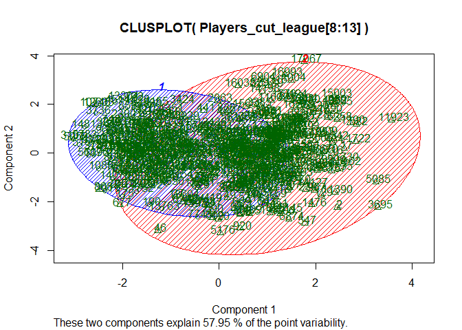
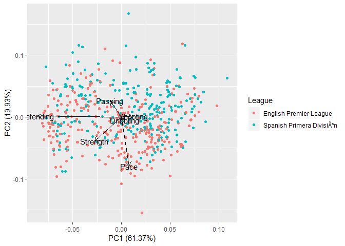
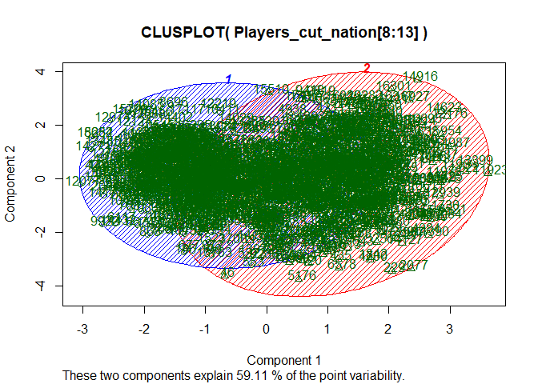
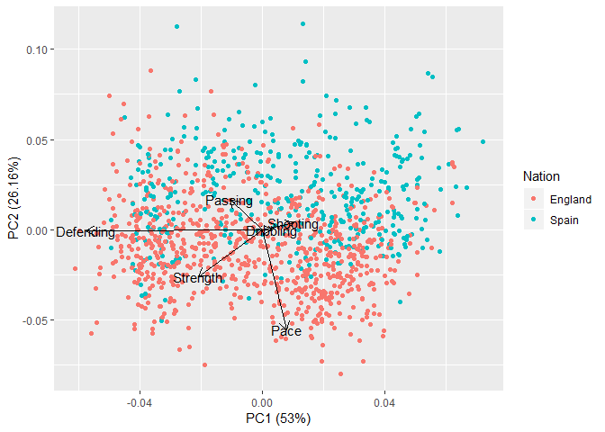

Project 2
================
Brian Childers
December 10, 2018

I wanted to investigate a stereotype that in soccer, Spanish wingers tend to be more technical and English wingers tend to be more physical. To look at this, I used data from FIFA 18, where players are rated on many attributes by scouts and given scores between 1 and 99. I wanted to only look at wingers, so I made sure that the players included were only those with a small disparity between their overall score and their winger score, meaning they are wingers. I also include all of the data about their shooting, passing, dribbling, defending, strength, and pace. Pace, strength, and defending are physical attributes, while the others are technical.

I wanted to compare players' stats relative to their overall rating to fairly compare players across skill levels. Thus, players with a "Pace" of 5 had 5 more pace than their overall stat, E.G. an overall rating of 80 and 85 pace. This denotes a players with more pace than expected given their base ability.

``` r
FIFA18 <- read.csv(url("https://raw.githubusercontent.com/kevinheavey/fifa18-even-more-player-data/master/data/final/current/complete.csv"))
FIFA18_cut1 <- FIFA18[,c(2,8,10,11,15,20,22:27,29,30,31,32,69,71,73,79,83,90)]

FIFA18_wingers <- cbind(FIFA18_cut1,
                        FIFA18_cut1$overall - FIFA18_cut1$rw,
                        FIFA18_cut1$overall - FIFA18_cut1$lw,
                        FIFA18_cut1$overall - FIFA18_cut1$pac,
                        FIFA18_cut1$overall - FIFA18_cut1$sho,
                        FIFA18_cut1$overall - FIFA18_cut1$pas,
                        FIFA18_cut1$overall - FIFA18_cut1$dri,
                        FIFA18_cut1$overall - FIFA18_cut1$def,
                        FIFA18_cut1$overall - FIFA18_cut1$phy)
Fifa18_wing_feat <- FIFA18_wingers[,c(1:5, 23:30)]
colnames(Fifa18_wing_feat) <- c("Name", "League", "Height", "Weight", "Nation", "RW", "LW", "Pace", "Shooting", "Passing", "Dribbling", "Defending", "Strength")
Fifa18_wing_feat[8:13] <- -Fifa18_wing_feat[8:13]

Players_cut <- Fifa18_wing_feat[which(abs(Fifa18_wing_feat$RW) < 5),]
```

First I look at players by league. If they are in the Spanish top division, they are placed in one category, and if in the English top division they are in another. I expected a small association here compared to looking at them by nationality.

A kmeans clustering approach shows that there is good reason to cluster by these attributes. 60% of the variation is captured in 2 principal components, and the clusters show a clear dilineation between clusters on these components. The first cluster tends to be quicker and weaker, but poor passers and defenders. This suggests that one way of thinking about the data is to seperate the wingers into smaller and quicker players vs larger and more technical. This does not map as cleanly onto my assumptions as I expected.

``` r
Players_cut_league <- Players_cut[which(Players_cut$League == "English Premier League" | Players_cut$League == "Spanish Primera División"),]

Clus_League <- kmeans(Players_cut_league[8:13], 2)
Players_clus_league <- data.frame(Players_cut_league, Clus_League$cluster)
aggregate(Players_clus_league[8:13],by=list(Clus_League$cluster),FUN=mean)
```

    ##   Group.1      Pace  Shooting   Passing Dribbling Defending   Strength
    ## 1       1 0.2971698 -8.806604 -2.410377 0.9669811 -12.71698  -5.622642
    ## 2       2 4.6098361 -4.481967 -7.111475 2.2000000 -40.62295 -13.308197

It does, however, seem that clustering on those values leads to a lot of overlap in the clusters.

``` r
library(cluster) 
clusplot(Players_cut_league[8:13], Clus_League$cluster, color=TRUE, shade=TRUE, 
         labels=2, lines=0)
```



Looking at the principal components, we do see a general trend towards more physical players in the bottom of the plot with more English league players, and more technical players in the top and right, who play in the Spanish league.

``` r
library(ggfortify)
```

    ## Loading required package: ggplot2

``` r
autoplot(prcomp(Players_cut_league[8:13]), data = Players_clus_league,
         colour = 'League', loadings=T, loadings.colour='black', loadings.label=T, loadings.label.colour='black')
```



Now looking at players and English vs Spanish nationality, we see stronger results as expected.

``` r
Players_cut_nation <- Players_cut[which(Players_cut$Nation == "Spain" | Players_cut$Nation == "England"),]

Clus_Nation <- kmeans(Players_cut_nation[8:13], 2)
Players_clus_nation <- data.frame(Players_cut_nation, Clus_Nation$cluster)
aggregate(Players_clus_nation[8:13],by=list(Clus_Nation$cluster),FUN=mean)
```

    ##   Group.1     Pace  Shooting   Passing Dribbling Defending  Strength
    ## 1       1 5.063356 -8.835616 -2.464041 0.4708904 -11.28938 -1.630137
    ## 2       2 9.986949 -4.311582 -8.123980 1.5106036 -36.04078 -8.515498

The clusters are very similar to before, but we now have a somewhat different sample of players. The clusters still don't map onto my expectations exactly as I thought.

``` r
clusplot(Players_cut_nation[8:13], Clus_Nation$cluster, color=TRUE, shade=TRUE, 
         labels=2, lines=0)
```



The most important and substantial finding is below. There is a very strong trend of Spanish players being more technical, and English players being more physical. This does support my expectations of more technical Spanish wingers and more physical English wingers.

``` r
autoplot(prcomp(Players_cut_nation[8:13]), data = Players_clus_nation,
         colour = 'Nation', loadings=T, loadings.colour='black', loadings.label=T, loadings.label.colour='black')
```



This analysis supports the stereotypes of English wingers and fast and strong, but lacking in technical ability compared to their Spanish counterparts. The dominance of the Spanish league in international competitions, and the Spanish national team's unprecidented success in the early 2010's supports the idea that having more technical players translates to better success compared to selecting and training more physical players.
