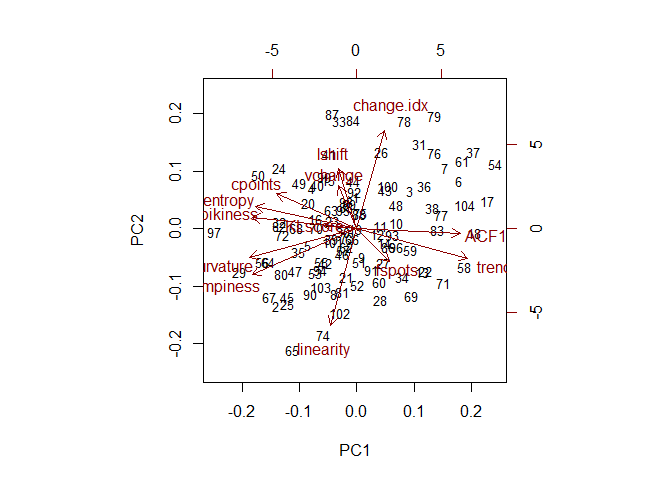
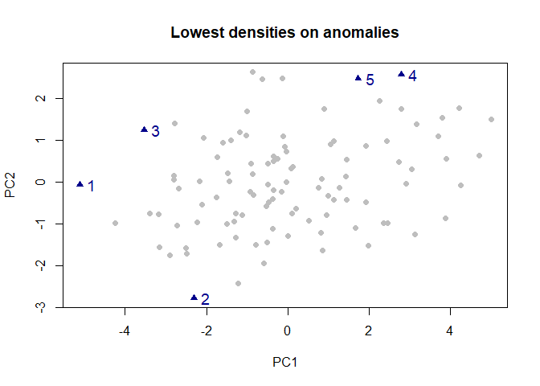
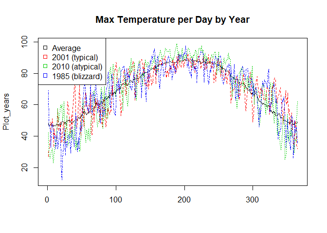

Project 3
================
Brian Childers
December 10, 2018

For this project, I explore a new outlier detection method for time series anomaly detection. This method is from the R package Anomalous, which was written by Rob Hyndman to help detect unusual patterns of behavior for Yahoo email servers. I will explain the method as I perform the analysis on about 100 years of Knoxville Weather (Daily High degrees F) data. My aim is to detect unusual years in the data. This is different from typical outlier detection that would try to detect one observation that is anomalous; instead it attempts to identify features of time series themselves that make them different from other, similar series.

First I read in the data and install the package

``` r
library(readr)
Weather <- read_csv("C:/Users/Brian/Dropbox/MSBA/Zhou Data Mining/AA Blog posts/Weather.csv")
```

    ## Parsed with column specification:
    ## cols(
    ##   `Max Temp` = col_integer(),
    ##   Year = col_integer(),
    ##   Month = col_integer(),
    ##   Day = col_integer()
    ## )

``` r
Weather_cut <- Weather[c(1,2)]

a <- do.call('data.frame', split(Weather_cut[1], Weather_cut$Year))
colnames(a) <- c(1911:1933,1935:1938,1940:1946,1948:2017)

devtools::install_github("robjhyndman/anomalous")
```

    ## Skipping install of 'anomalous' from a github remote, the SHA1 (7d8f5052) has not changed since last install.
    ##   Use `force = TRUE` to force installation

``` r
library(anomalous)
```

    ## Loading required package: ForeCA

    ## Loading required package: ifultools

    ## This is 'ForeCA' version 0.2.4. Please see the NEWS file and citation("ForeCA").
    ## May the ForeC be with you.

    ## This is anomalous 0.1.0

Next, I compute a dataframe of features for each year in the data. These features are described in detail in his 2015 paper and the calculations are available in the source code on his GitHub. The features include lumpiness, entropy, autocorrelation, level shift, vertical change, change points, flat spots, trend, linearity, curvature, spikiness, Kullback-Leibler score, and the index of the max KL value. An example of this data is shown below. That dataframe is reduced to 2 principal components, plotted below. This allows for outlier detection on 2 dimensions. For cyclical data, 3 additional features can be calculated that add additional information, though this data is not cyclical so they are omitted.

``` r
features <- tsmeasures(a)
head(features)
```

    ##       lumpiness   entropy      ACF1    lshift   vchange cpoints fspots
    ## [1,] 0.02439820 0.6087678 0.8857141 0.8771364 0.2901279      49      9
    ## [2,] 0.01660273 0.5906388 0.9149632 0.8965451 0.5700275      36     19
    ## [3,] 0.02856953 0.6299037 0.8933368 0.9191359 0.6554174      52      7
    ## [4,] 0.01614711 0.6153294 0.9121658 0.8154625 0.4062466      42     12
    ## [5,] 0.02703345 0.6090873 0.9207568 1.3057694 0.7049250      16     12
    ## [6,] 0.05824770 0.6670738 0.8829864 0.9570399 0.5886996      43     18
    ##          trend linearity curvature    spikiness  KLscore change.idx
    ## [1,] 0.7918644  2.713845 -15.36493 9.679769e-07 1.638420        338
    ## [2,] 0.8294440  5.029687 -16.25345 4.450250e-07 2.177910         16
    ## [3,] 0.7452873  2.354627 -14.72802 1.119900e-06 2.611821        105
    ## [4,] 0.7887734  2.380381 -15.80161 6.959469e-07 2.890748        343
    ## [5,] 0.8038267  4.250191 -15.44830 5.451884e-07 4.190456         94
    ## [6,] 0.6981789  2.247453 -14.86492 1.610475e-06 4.034426        345

``` r
biplot.features(features)
```



Next the process uses a bivariate kernal density estimate as described in the paper to detect the 5 worst outliers from the rest of the series based on those 2 principal components. I then identify which years in the data are the worst outliers.

``` r
outliers <- anomaly(features, n=5, robust=T, plot=T, labels=T)
```



``` r
outliers$index
```

    ## [1] 97 65 50 79 78

``` r
years <- c(1911:1933,1935:1938,1940:1946,1948:2017)
years[outliers$index]
```

    ## [1] 2010 1978 1963 1992 1991

Next, I plot some of the years that are most interesting from the data. First, I show an average year taken by the column means. 2001 was the most typical years, with 2010 the most atypical year, so I plotted them both. Additionally, 1985 is often remembered as one of the worst blizzards in area history, so it is interesting that it was not detected as an outlier. I plotted it as well to compare.

``` r
Avg_year <- rowMeans(a)
Plot_years <- data.frame(Avg_year, a$`2001`,a$`2010`, a$`1985`)
matplot(Plot_years, type = c("l"),col = 1:4, main="Max Temperature per Day by Year")
legend("topleft", legend = c("Average","2001 (typical)","2010 (atypical)","1985 (blizzard)"), col=1:4, pch=.1)
```



By looking at the plot, we see that the atypical year, 2010, had a very hot summer. A quick google search concluded that 2010 was among the hottest years on record. It also had a relatively cold winter. This could contribute to a more curved shape of the graph, adding to some of the calculated features and causing it to be an outlier. While I expected to see 1985 as an outlier, it was really only the cold few weeks that stood out, otherwise it was a normal year.

To conclude, this method can be very powerful in detecting subtle outleirs using features of the individual series. It is particularly useful for cyclical data, which unfortunately we do not have here. This is a useful application for detecting time series outliers that traditional outlier detecting does not deal with well.
